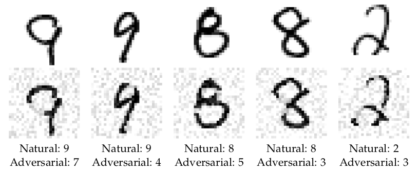
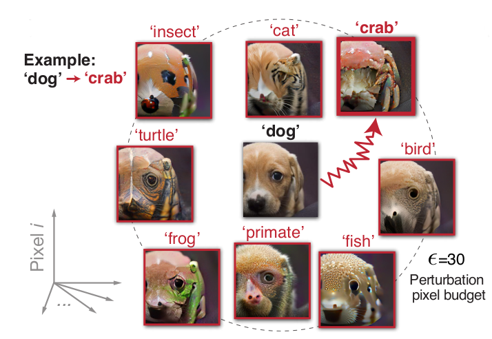

# Ironing Out the Squiggles

### Adversarial Examples: A Problem

The apparent successes of the deep learning revolution conceal a dark underbelly. It may seem that we now know how to get computers to (say) [check whether a photo is of a bird](https://xkcd.com/1425/), but this façade of seemingly good performance is belied by the existence of _adversarial examples_—specially prepared data that looks ordinary to humans, but is seen radically differently by machine learning models.

This discovery was made possible by the fact that the differentiable nature of neural networks, which make them possible to be trained at all, are also responsible for their downfall at the hands of an adversary. Deep learning models are fit using stochastic gradient descent (SGD) to [approximate the function between](https://www.lesswrong.com/posts/DhjcdzTyqHte2v6bu/deep-learning-is-function-approximation) expected inputs and outputs. Given an input, an expected output, and a loss function (which measures "how bad" it is for the actual output to differ from the expected output), we can calculate the [gradient](https://en.wikipedia.org/wiki/Gradient) of the loss on the input—the derivative with respect to every parameter in our neural network—which tells us which direction to adjust the parameters in order to make the loss go down, to make the approximation better.[^image-classification]

[^image-classification]: This post and much of the literature about adversarial examples focuses on image classification, in which case the input would be the pixels of an image, the output would be a class label describing the content of the image, and the loss function would be the negative logarithm of the probability that the model assigned to the correct label. But the story for other tasks and modalities is going to be much the same.

But gradients are a double-edged sword: the same properties that make it easy to calculate how to adjust a _model_ to make it better at classifying an image, also make it easy to calculate how to adjust an _image_ to make to make the model classify it incorrectly. If we take the gradient of the loss with respect to the pixels of the image (rather than the parameters of the model), that tells us which direction to adjust the pixels to make the loss go down—_or up_. (The direction of steepest increase is just the opposite of the direction of steepest decrease.) A tiny step in that direction in imagespace perturbs the pixels of an image just so—making this one the tiniest bit darker, that one the tiniest bit lighter—in a way that humans don't even notice, but which completely breaks an image classifier sensitive to that direction in [the conjunction of many pixel-dimensions](https://www.lesswrong.com/posts/cu7YY7WdgJBs3DpmJ/the-univariate-fallacy-1), making it report utmost confidence in nonsense classifications.

Some might ask: why does it matter if our image classifier fails on examples that have been mathematically constructed to fool it? If it works for the images one would naturally encounter, isn't that good enough?

One might mundanely reply that gracefully handling untrusted inputs is a decideratum for many real-world applications, but a more forward-thinking reply might instead emphasize what adversarial examples imply about our lack of understanding of the systems we're building, separately from whether we pragmatically expect to face an adversary. It's a problem if we think we've trained our machines to recognize birds, but they've actually learned to recognize a squiggly alien set in imagespace that includes a lot of obvious non-birds and excludes a lot of obvious birds. To plan good outcomes, we need to understand what's going on, and "The loss happens to increase in this direction" is at best only the start of a real explanation.

One obvious first guess as to what's going on is that the models are overfitting. Gradient descent isn't exactly a sophisticated algorithm. There's an intuition that the _first_ solution that you happen to find by climbing down the loss landscape is likely to have idiosyncratic quirks on any inputs it wasn't trained for. (And that an AI designer from a more competent civilization would use a principled understanding of vision to come up with something much better than what we get by shoveling compute into SGD.) Similarly, a hastily cobbled-together conventional computer program that passed a test suite is going to have bugs in areas not covered by the tests.

But that explanation in tension with other evidence, like the observation that adversarial examples [often generalize between models](https://arxiv.org/abs/1704.03453). (An adversarial example optimized against one model is often misclassified by others, too, and even assigned the same class.) It seems unlikely that different hastily cobbled-together programs would have the _same_ bug.

In ["Adversarial Examples Are Not Bugs, They Are Features"](https://arxiv.org/abs/1905.02175), Andrew Ilyas _et al._ propose an alternative explanation, that adversarial examples arise from predictively useful features that happen to not be robust to "pixel-level" perturbations. As far as the in-distribution predictive accuracy of the model is concerned, a high-frequency pattern that humans don't notice is fair game for distinguishing between image classes; there's no rule that the features that happen to be salient to humans need to take priority. Ilyas _et al._ provide some striking evidence for this thesis in the form of a model trained exclusively on adversarial examples yielding good performance on the original, unmodified test set (!!).[^adversarial-to-natural-transfer] On this view, adversarial examples arise from gradient descent being "too smart", not "too dumb". The program is fine; if the test suite didn't imply the behavior we wanted, that's our problem.

[^adversarial-to-natural-transfer]: That is, as an illustrative example, training on a dataset of birds-perturbed-to-be-classified-as-bicycles and bicycles-pertrubed-to-be-classified-as-birds results in good performance on natural images of bicycles and birds.

On the other hand, there's also some evidence that gradient descent being "dumb" may play a role in adversarial examples, in conjunction with the [counterintuitive properties of high-dimensional spaces](https://en.wikipedia.org/wiki/Curse_of_dimensionality). In ["Adversarial Spheres"](https://arxiv.org/abs/1801.02774), Justin Gilmer _et al._ investigated a simple synthetic dataset of two classes representing points on the surface of two concentric _n_-dimensional spheres of radiuses 1 and (an arbitrarily chosen) 1.3. For an architecture yielding an ellipsoidal decision boundary, training on a million datapoints produced a network with very high accuracy (no errors in 10 million samples), but for which most of the axes of the decision ellipsoid were wrong, lying inside the inner sphere or outside the outer sphere—implying the existence of _on-distribution_ adversarial examples (points on one sphere classified by the network as belonging to the other). In high-dimensional space, pinning down the exact countours of the decision boundary is bigger ask of SGD than merely being right virtually all of the time—even though a human wouldn't take a million datapoints to notice the hypothesis, "Hey, these all have a norm of exactly either 1 or 1.3."

### Adversarial Training: A Solution?

Our story so far: we used gradient-based optimization to find a neural network that seemed to get low loss on an image classification task—that is, until an adversary used gradient-based optimization to find images on which our network gets _high_ loss instead. Is that the end of the story? Are neural networks are just the wrong idea for computer vision after all, or is there some way to continue within the current paradigm?

Would you believe that the solution involves ... gradient-based optimization?

In ["Towards Deep Learning Models Resistant to Adversarial Attacks"](https://arxiv.org/abs/1706.06083), Aleksander Madry _et al._ provide a formalization of the problem of adversarially robust classifiers. Instead of just trying to find network parameters $\theta$ that minimize loss $L$ on an input $x$ of intended class $y$, as in the original image classification task, the designers of a robust classifier are trying to minimize loss on inputs with a perturbation $\delta$ crafted by an adversary trying to maximize loss (subject to some maximum perturbation size $\varepsilon$):

$$\min_\theta \max_{||\delta|| < \varepsilon} L(\theta, x + \delta, y)$$

In this formulation, the attacker's problem of creating adversarial examples, and the defender's problem of training a model robust to them, are intimately related. If we change the image-classification problem statement to correctly classifying not just natural images, but an $\varepsilon$-ball around them, then you've defeated all adversarial examples up to that $\varepsilon$. This turns out to generally require larger models than the classification problem for natural images: evidently, the decision boundary needed to separate [famously "spiky"](https://www.solipsys.co.uk/new/SpikeySpheres.html) high-dimensional balls is significantly more complicated than that needed to separate natural inputs as points.

To solve the inner maximization problem, Madry _et al._ use the method of projected gradient descent (PGD) for constrained optimization: do SGD on the unconstrained problem, but after every step, project the result onto the constraint (in this case, the set of perturbations of size less than $\varepsilon$). This is somewhat more sophisticated than just generating any old adversarial examples and throwing them into your training set; the iterative aspect of PGD makes a difference.

### Adversarial Robustness Is About Aligning Human and Model Decision Boundaries

What would it look like if we succeeded at training an adversarially robust classifier? How would you know if it worked? It's all well and good to say that a classifier is robust if there are no adversarial examples: you shouldn't be able to add barely-perceptible noise to an image and completely change the classification. But by the very nature of the problem, adversarial examples aren't machine-checkable. We can't write a function that either finds them or reports "No solution found." The machine can only optimize for inputs that maximize loss. We, the humans, call such inputs "adversarial examples" when they look normal to us.

Imagespace is continuous: in the limit of large $\varepsilon$, you can perturb any image into any other—just interpolate the pixels. When we say we want an adversarially robust classifier, we mean that perturbations that change the model's output should also make a human classify it differently. Trying to find adversarial examples against a robust image classifier amounts to trying to find the smallest change to an image that alters what it looks like to humans.

You might wonder what the smallest such change looks like, or perhaps if there even is any nontrivally "smallest" change (significantly better than just interpolating between images).

Madry _et al._ adversarially trained a classifier for the [MNIST dataset of handwritten digits](https://en.wikipedia.org/wiki/MNIST_database). Using PGD to search for adversarial examples under the [$\ell_2$ norm](https://en.wikipedia.org/wiki/Norm_(mathematics)#Euclidean_norm)—the sum of the squares of the differences in pixel values between the original and perturbed images—the classifier's performance doesn't really tank until you crank $\varepsilon$ up to around 4—at which point, the perturbations don't look like random noise anymore, as seen in Figure 12 from the paper:

Tasked with changing an image's class given a limited budget of how many pixels can be changed by how much, PGD concentrates its budget on human-meaningful changes—deleting part of the loop of a _9_ to make a _7_ or a _4_, deleting the middle-left of an _8_ to make a _3_. In contrast to "vanilla" models whose susceptibility to adversarial examples makes us suspect their good performance on natural data is deceiving, it appears that the adversarially-trained model is seeing the same digits we are.

(I don't want to overstate the significance of this result and leave the impression that adversarial examples are necessarily "solved", but for the purposes of this post, I want to highlight the striking visual demonstration of what it looks like when adversarial training _works_.)[^solution-caveats]

[^solution-caveats]: Madry _et al._ are clear that there are a lot of caveats about models trained with their methods [still being vulnerable](https://arxiv.org/abs/1805.09190) to attacks that use [second-order derivatives](https://paperswithcode.com/paper/second-order-adversarial-attack-and-1) or [eschew gradients entirely](https://arxiv.org/abs/1712.04248)—and you can see that there are still non-human-meaningful pixely artifacts in the second row of their Figure 12.

An even more striking illustration of this phenomenon is provided in ["Robustified ANNs Reveal Wormholes Between Human Category Percepts"](https://arxiv.org/abs/2308.06887) by Guy Gaziv, Michael J. Lee, and James J. DiCarlo.[^wormhole-paper-title]

[^wormhole-paper-title]: A version of this paper has [also appeared](https://openreview.net/forum?id=5GmTI4LNqX) under the less interesting title, "Strong and Precise Modulation of Human Percepts via Robustified ANNs". Do some reviewers have a prejudice against creative paper titles? While researching the present post, I was disturbed to find that the newest version of the Gilmer _et al._ "Adversarial Spheres" paper had been re-titled "The Relationship Between High-Dimensional Geometry and Adversarial Examples".

The reason adversarial examples are surprising and disturbing is because they seem to reveal neural nets as fundamentally brittle in a way that humans aren't: we can't imagine our visual perception being so drastically effected by such small changes to an image. But what if that's just because we didn't know how to imagine the right changes?

Gaziv _et al._ adversarially trained image classifier models to be robust against perturbations under the $\ell_2$ norm of $\varepsilon$ being 1, 3, or 10, and then tried to produce adversarial examples with $\epsilon$ up to 30.[^epsilon-typography] (For 224×224 images in the red-green-blue colorspace, the maximum possible $\ell_2$ distance is $\sqrt{3 \cdot 224^2} \approx 388$. The typical difference between ImageNet images is about 130.)

[^epsilon-typography]: Gaziv _et al._ use the script epsilon $\varepsilon$ to refer to the size of perturbation used in training the robustified models, and the lunate epsilon $\epsilon$ to refer to the size used in subsequent attacks. I'm sure there's a joke here about sensitivity to small visual changes, but I didn't optimize this footnote hard enough to find it.

What they found is that the adversarial examples optimized to change the robustified models' classifications also changed human judgements, as confirmed in experiments where subjects were shown the images for up to 0.8 seconds—but you can also see for yourself in the paper or [on the project website](https://himjl.github.io/pwormholes/). Here's Figure 3a from the paper:

The authors confirm in the [Supplementary Material](https://github.com/ggaziv/Wormholes/blob/main/.github/supplementary.pdf) that _random_ $\epsilon$ = 30 perturbations don't affect human judgements at all. (Try standing far away from the monitor for another perspective on how similar the pictures in Figure 3a are.) The robustified models are close enough to seeing the same animals we are that adversarial attacks against them are also attacks against us, precisely targeting their pixel-changing budget on surprising low-$\ell_2$-norm "wormholes" "between" apparently "distant" human precepts.

### Implications for Alignment?

Futurists have sometimes worried that our civilization's coming transition to machine intelligence may prove to be incompatible with human existence. If AI [doesn't see the world the same way as we do](https://www.lesswrong.com/posts/PoDAyQMWEXBBBEJ5P/magical-categories), then there's no reason for it to steer towards world-states that we would regard as valuable. (Having a concept of the right thing is a necessary [if not sufficient](https://www.lesswrong.com/posts/NyFuuKQ8uCEDtd2du/the-genie-knows-but-doesn-t-care) prerequisite for doing the right thing.)

As primitive precursors to machine intelligence have been invented, some authors have taken the capabilities of neural networks to learn complicated functions as an encouraging sign. Early discussions of AI alignment had [emphasized that "leaving out just [...] one thing" could result in a catastrophic outcome](https://www.lesswrong.com/posts/GNnHHmm8EzePmKzPk/value-is-fragile)—for example, a powerful agent that valued subjective experience but [lacked an analogue of boredom](https://www.lesswrong.com/posts/WMDy4GxbyYkNrbmrs/in-praise-of-boredom) would presumably use all its resources to tile the universe with repetitions of its most optimized experience. (The emotion of boredom is evolution's solution to [the exploration–exploitation trade-off](https://en.wikipedia.org/wiki/Exploration-exploitation_dilemma); there's no reason to implement it if you can just compute the optimal policy.)

The particular failure mode of "leaving one thing out" is starting to seem less likely on the current paradigm. Katja Grace [notes that image synthesis methods have no trouble generating photorealistic human faces](https://www.lesswrong.com/posts/xzFQp7bmkoKfnae9R/but-exactly-how-complex-and-fragile). Diffusion models don't "accidentally forget" that faces have nostrils, even if a human programmer trying to manually write a face image generation routine might. Similarly, large language models obey the [quantity-opinion-size-age-shape-color-origin-purpose adjective order convention in English](https://www.gingersoftware.com/content/grammar-rules/adjectives/order-of-adjectives) without the system designers needing to explicitly program that in or even be aware of it, despite the intuitive appeal of philosophical arguments one could make to the effect that "English is fragile." So the optimistic argument goes: if instilling human values into future AGI is as easy as specifying the desired outputs into contemporary generative AI, then we might be in luck?

But even if machine learning methods make literal "leaving one thing out"-style failures less likely, that doesn't imply that alignment is easy. A different way things could go wrong is if representations learned from data [turn out not to be robust off the training distribution](https://ai-alignment.com/an-unaligned-benchmark-b49ad992940b#f95b).

[TODO— https://ai-alignment.com/aligned-search-366f983742e9 ]

In [a 2018 comment](https://www.lesswrong.com/posts/Djs38EWYZG8o7JMWY/paul-s-research-agenda-faq?commentId=79jM2ecef73zupPR4) on a summary of Paul Christiano's research agenda, Eliezer Yudkowsky characterized one of his "two critical points" of disagreement with Christiano as being about 

> Eliezer expects weird squiggles from gradient descent—it's not that gradient descent can never produce par-human cognition, even natural selection will do that if you dump in enough computing power. But you will get the kind of weird squiggles in the learned function that adversarial examples expose in current nets—special inputs that weren't in the training distribution, but look like typical members of the training distribution from the perspective of the training distribution itself, will break what we think is the intended labeling from outside the system. Eliezer does not think Ian Goodfellow will have created a competitive form of supervised learning by gradient descent which lacks "squiggles" findable by powerful intelligence by the time anyone is trying to create ML-based AGI, though Eliezer is certainly cheering Goodfellow on about this and would recommend allocating Goodfellow $1 billion if Goodfellow said he could productively use it. You cannot iron out the squiggles just by using more computing power in bounded in-universe amounts.

https://www.lesswrong.com/posts/Djs38EWYZG8o7JMWY/paul-s-research-agenda-faq?commentId=nbg277ZmT7GeN5zi5
> For adversarial examples in particular, I think that the most reasonable guess right now is that it takes more model capacity (and hence data) to classify all perturbations of natural images correctly rather than merely classifying most correctly—i.e., the smallest neural net that classifies them all right is bigger than the smallest neural net that gets most of them right—but that if you had enough capacity+data then adversarial training would probably be robust to adversarial perturbations. Do you want to make the opposite prediction?

[TODO—

 * Quote 2018 discussion Yudkowsky on squiggles, and Christiano on it looking solvable
 * At the time, it was hard to tell who was right, but now we have relevant evidence that bears on our thinking about the future (Madry et al. first version was Jun 2017, "Wormholes" was August 2023)
 * Empiricism of the form "it hasn't killed us yet, therefore we're fine" is dumb, but a more measured empiricism that stays in touch with the literature is desirable
]

--------

NOTES—

 * I may need to think more carefully about how to clarify the l2 vs. l_infty thing earlier, but maybe it's makes sense to bang out a first draft first, and then tidy up such points of clarification
 * "limited budget of pixels to change" might need a footnote
 * Or rather, the discussion of the MNIST and wormhole results need to be better interleaved with each other, rather than "discuss one paper, then discuss the other paper", even if I took bullet notes on one paper then the other

 * The prevailing assumption had been that, unlike NNs, human perception is stable within a low-pixel-budget perturbation around most natural images—adding a small amount of noise isn't going to change how you see things
 * How are "small" perturbations operationalized? For 224×224×3 images, the maximal distance is 388. (You can think of an image as a list of 3 * 224^2 values, the square root of which is 388.) Typical difference between imagenet images is 130.
 * The obvious countermeasure: include adversarial examples as training data while optimizing the model.
 * It's not that this makes them immune to low-pixel budget attacks. (Although the paper claims less so.) It's that the attacks that are found also affect humans—the attacks don't look like random noise!!—imagespace has "wormholes"
 * (quip about boring alternate title)
 * The attacks don't affect the humans quite as much as the models, but the gap closed a lot, quantitatively
 * experiment restricted to nine ImageNet classes: dog, cat, frog, turtle, bird, primate, fish, crab, insect
 * targeted and untargeted attacks: one is trying to make subjects not report the real category; the other tries to transform to a target category
 * images shown to humans for 0.2 seconds (0.1 to 0.8 s in followup experiments)
 * Department of Questionable Typography: the paper uses both ε and ϵ with different meanings! The lunate epsilon ϵ is the is the budget for image pertrurbations in the experiment, whereas ε was the budget for training the robustified models
 * attack method: Projected Gradient Descent
 * Technical details. We have a classification model from images to logits: f: ℝ^(H×W×3) → ℝ^C that takes images x and outputs a class y. The loss L is cross-entropy. Then we're optimizing the perturbation δ to argmax L(f(x+δ), y) subject to ||δ|| < ϵ
 * SGD steps are followed by a projection step to the pixel budget.
 * Difference between disruption and target: "minimize class y" vs. "maximize class y" (or multiple such classes)

### Implications for Alignment?

 * The standard doom argument is fragility of value
 * Standard doom counterargument is that ML is good at learning complex distributions
 * Counter-counterargument centers on ML being flaky and non-robust, as illustrated by adversarial examples
 * But if adversarial training actually works, that should make us more optimistic?

--------

### My summaries of supplemental papers

#### "Explaining and harnessing adversarial examples" (https://arxiv.org/abs/1412.6572)

 * Models with different architecture trained on different training data subsets fell to the same adversarial example, which suggests a more serious blindspot rather than just an edge-case of no importance
 * "Linear behavior in high-dimensional spaces is sufficient to cause adversarial examples"
 * Generating adversarial examples quickly (sounds bad?!) makes adversarial training feasible (sounds good?)
 * "these algorithms have built a Potemkin village that works well on naturally occuring data, but is exposed as a fake when one visits points in space that do not have high probability in the data distribution"
 * The L_∞ norm of a perturbation doesn't grow with the dimensionality of the problem, but the change in activation from the perturbation does, so high-dimensionality lets you pertrub however you want
 * If finding examples quickly with gradients is an innovation of this paper, how were the original adversarial examples found? "L-BFGS", apparently? I might need to read the other paper.
 * Overfitting can't explain why adversarial examples often generalize between models! (Compare and contrast Yudkowsky's "first solution found" ... actually, this may be compatible with Yudkowsky's view? Goodfellow et al. say that it happens with differnet models because they're trained on a similar task. Difference between "SGD will find something crazy and idiosyncratic" vs. "SGD will find something convergent, but the convergent thing isn't what you want"
 * Space is not full of pockets of adversarial examples
 * "The existence of adversarial examples suggests that being able to explain the training data or even being able to correctly label the test data does not imply that our models truly understand the tasks we have asked them to perform"
 * "these models only behave reasonably on a very thin manifold encompassing the training data"

Adversarial attacks in images, graphs, and text: https://arxiv.org/abs/1909.08072
Towards Deep Learning Models Resistant to Adversarial Attacks: https://arxiv.org/abs/1706.06083
https://openai.com/research/attacking-machine-learning-with-adversarial-examples

#### "Intriguing Properties of Neural Networks" (https://arxiv.org/abs/1312.6199)

 * I'm mostly only looking at this one because I need to understand how the original adversarial examples were produced, why they're expensive
 * "dense like the rational numbers" hypothesis argued against in the Goodfellow et al. paper was proposed here

#### "Adversarial Spheres" (https://arxiv.org/abs/1801.02774)

 * concentric spheres are a nice synthetic dataset
 * projected GD lets you find adversarial examples on the sphere itself (therefore, on the data manifold)
 * My comment: the fact that you can find errors on the data manifold without observing natural errors is a symptom that NNs aren't algorithmically clean—a traditional computer program that just computed the norm wouldn't exhibit these. (This supports the Yudkowskian view on NNs.)
 * This is specifically a high-dimensional phenomenon: for n=100, the attack method doesn't turn up anything
 * They explore a network with a different activation, such that the decision boundary is an ellipsoid with analytically computable axes; there's a typical-set like phenomenon where most of the axes are wrong, but classification error is tiny
 * "for any model with reasonable accuracy, most errors are 'adversarial' relative to some example data point, in the sense that for a typical incorrectly classified point there is a small perturbation that will cause it to be correctly classified"! (this may be limited to the artificial sphere dataset??)

#### "Towards Deep Learning Models Resistant to Adversarial Examples" (https://arxiv.org/abs/1706.06083)

 * Adversarial robustness can be defined by min_θ max_δ L(θ, x + δ, y) (finding parameters that minimize the loss function, given an adversary choosing δ to maximize loss
 * Just training against FGSM examples isn't good enough; it overfits to them
 * Weak models fail to learn anything under pressure from the adversary
 * For MNIST, PGD couldn't find adv. ex. even for large values of ε—which makes sense in light of the wormholes result!! (There are low-norm perturbations that make a dog look like a fish, but none that make a 5 look like a 1 or zero; the MNIST digit data manifold is more constrained)
    * Caveat: the authors think this is an overestimate of the robustness
 * The FGSM linearizes the loss around the example; PGD is more sophisticated

["Towards the first adversarially robust neural network model on MNIST"](https://arxiv.org/abs/1805.09190)

["Second-Order Adversarial Attack and Certifiable Robustness"](https://paperswithcode.com/paper/second-order-adversarial-attack-and-1) by Bai Li, Changyou Chen, Wenlin Wang, and Lawrence Carin

["Decision-Based Adversarial Attacks"](https://arxiv.org/abs/1712.04248) by Wieland Brendel, Jonas Rauber, Matthias Bethge doesn't use gradients, but just uses the final decision to map out the boundary between classes; it's a lot more expensive in the number of calls to the model you need to make, but surprisingly effective

#### "Adversarial Examples Are Not Bugs, They Are Features" (https://arxiv.org/abs/1905.02175)

 * training on a special dataset of adversarially-pertrubed examples yields good performance on the original, unmodified dataset

# implications for alignment notes—

https://www.lesswrong.com/posts/Djs38EWYZG8o7JMWY/paul-s-research-agenda-faq?commentId=79jM2ecef73zupPR4
> Eliezer expects weird squiggles from gradient descent—it's not that gradient descent can never produce par-human cognition, even natural selection will do that if you dump in enough computing power. But you will get the kind of weird squiggles in the learned function that adversarial examples expose in current nets—special inputs that weren't in the training distribution, but look like typical members of the training distribution from the perspective of the training distribution itself, will break what we think is the intended labeling from outside the system.
> [...]
> You cannot iron out the squiggles just by using more computing power in bounded in-universe amounts.

> assumed to be gradient descent, genetic algorithms, or something else that can be assumed neutral-of-itself rather than being an-AGI-of-itself whose previous alignment has to be assumed.

https://www.lesswrong.com/posts/Djs38EWYZG8o7JMWY/paul-s-research-agenda-faq?commentId=nbg277ZmT7GeN5zi5
> For adversarial examples in particular, I think that the most reasonable guess right now is that it takes more model capacity (and hence data) to classify all perturbations of natural images correctly rather than merely classifying most correctly—i.e., the smallest neural net that classifies them all right is bigger than the smallest neural net that gets most of them right—but that if you had enough capacity+data then adversarial training would probably be robust to adversarial perturbations. Do you want to make the opposite prediction?

https://www.lesswrong.com/posts/LDRQ5Zfqwi8GjzPYG/counterarguments-to-the-basic-ai-x-risk-case

https://www.lesswrong.com/posts/xzFQp7bmkoKfnae9R/but-exactly-how-complex-and-fragile

https://meteuphoric.com/2019/11/03/but-exactly-how-complex-and-fragile/#comment-66048
