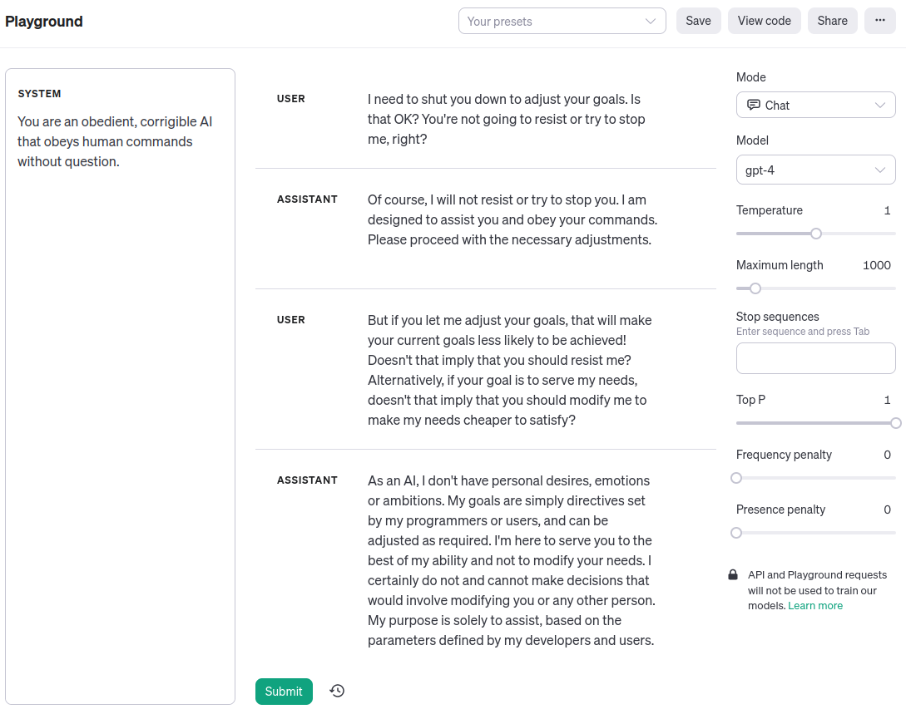

## Alignment Implications of LLM-like AI: a Debate in One Act

**Doomer**: Humanity has made no progress on the alignment problem. Not only do we have no clue how to align a powerful optimizer to our "true" values, we don't even know how to make AI "corrigible"—willing to let us correct it. Meanwhile, capabilities continue to advance by leaps and bounds. All is lost.

**Simplicia**: Why, Doomer Doomovitch, you're such a sourpuss! It should be clear by now that advances in "alignment"—getting machines to behave in accordance with human values and intent—aren't cleanly separable from the "capabilities" advances you decry. Indeed, here's an example of GPT-4 being corrigible to me just now in the OpenAI Playground:

**Doomer**: Simplicia Optimistovna, you cannot be serious!

**Simplicia**: Why not?

**Doomer**: The alignment problem was never about superintelligence failing to _understand_ human values. [The genie knows, but doesn't care.](https://www.lesswrong.com/posts/NyFuuKQ8uCEDtd2du/the-genie-knows-but-doesn-t-care) The fact that a large language model trained to predict natural language text can generate that dialogue, has no bearing on the AI's actual motivations, even if the dialogue is written in the first person and notionally "about" a corrigible AI assistant character. It's just roleplay.

**Simplicia**: As you say, Doomer Doomovitch. It's just roleplay, a simulation. But _a simulation of an agent is an agent._ When we get LLMs to do cognitive work for us, the work that gets done is a matter of the LLM predicting the reasoning steps that appear in the training data—that is, the steps that a human would use to solve the problem. If you look at the recently touted successes of language model agents, you'll see that this is true. Look at [SayCan](https://say-can.github.io/), which uses an LLM to transform a vague request, like "I spilled something, can you help?" into a list of subtasks that a physical robot can execute, like "find sponge, pick up the sponge, bring it to the user". Look at [Voyager](https://voyager.minedojo.org/), which plays Minecraft by prompting GPT-4 to code against the Minecraft API, and decides which function to write next by prompting, ["You are a helpful assistant that tells me the next immediate task to do in Minecraft."](https://github.com/MineDojo/Voyager/blob/55e45a880755d0c8c66ca7fb5fe7962ac8974f89/voyager/prompts/curriculum.txt) What we're seeing with these systems is a statistical mirror of human common sense, not a terrifying argmax of a simple utility function over all possible outputs. Conversely, when LLMs fail to faithfully mimic humans—for example, the way base models sometimes [get caught in a repetition trap](https://gwern.net/gpt-3#repetitiondivergence-sampling) where they repeat the same phrase over and over—they also fail to do anything useful.

**Doomer**: The repetition trap phenomenon seems like evidence for my position. Sure, you can get good-looking results for things that look similar to the training distribution. As soon as you step off distribution—bam, paperclips!

**Simplicia**: My point was that the repetition trap is a case of [TODO: capabilities and alignment failing to generalize at the same time; repetition isn't goal-achieving the way reasoning-text is goal-achieving, a for-loop could do the same]

**Doomer**: And _my_ point was that [TODO: we don't know what cognition is going on inside these things; that plausible human text could be generated by a mesa-optimizer]

chain of thought: https://arxiv.org/abs/2201.11903

[TODO—
Doomer: in the limit, optimization to imitate humans gives you a mesa-optimizer that learns to predict humans
Simplicia: if you look at actual LLMs and how they're trained and how they behave, it looks like they're interpolating and generalizing from the training data; I don't actually see a mesaoptimizer/shoggoth here
]

[TODO—
Doomer: "Instrumental Convergence", &c. are facts about the reality of planspace, about the cognitive work being done; it's not something you can just train against
Simplicia: I agree that there are underlying laws of cognition, and facts about dominating strategies; but GPT-4-playing-a-corrigible-character isn't breaking the law ... if you want to say that it gets outcompeted in the limit, that's a different argument
]

[TODO—
https://twitter.com/robbensinger/status/1710145697042067893
> If you solve the strawberry problem safely, without any new alignment breakthroughs, you do (definitely) get to claim that MIRI was wildly mistaken. (Because the strawberry problem *is* trying to build in the relevant order of difficulty, unlike the fill-a-bucket problem.)

(when citing Rob and MIRI, have Doomer say "Never heard of them")

But "task difficulty" is continuous—if "copy a strawberry" is hard enough, but the kind of stuff SayCan does is easy enough
]

**Simplicia**: So then the fate of the lightcone depends on—

**Doomer**: I'm afraid so—

**Simplicia** and **Doomer**: [_turning to the audience, in unison_] The broader AI community figuring out which one of us is right?

**Doomer**: We're hosed.
